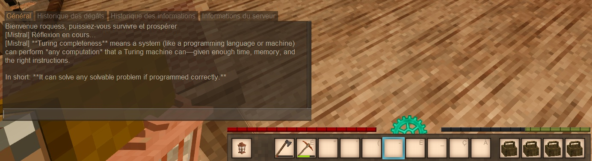

# chatAI — VintageStory Mod

A VintageStory server-side mod that lets players ask LLM questions in-game.

**By [Los Albatros](https://github.com/Los-Albatros) — MIT License**



## Commands

| Command | Description | Permission |
|---|---|---|
| `.ai <question>` | Ask the AI | all players |
| `.ai config show` | Show current config | `controlserver` |
| `.ai config provider <name>` | Change provider (`ollama`/`mistral`/`openai`) | `controlserver` |
| `.ai config apikey <key>` | Set API key for current provider | `chataimod.apikey` |

## Installation

1. Copy `chatAIVintageStoryMod.dll` to your VintageStory `Mods/` folder.
2. Start the server — a default `chataimod.json` is created in `ModConfig/`.
3. Edit `ModConfig/chataimod.json` or use `.ai config` commands to configure.

## Configuration (`ModConfig/chataimod.json`)

```json
{
  "Provider": "OLLAMA",
  "Ollama": { "Endpoint": "http://localhost:11434/api/generate", "Model": "mistral:7b" },
  "Mistral": { "ApiKey": "${MISTRAL_API_KEY}", "Model": "mistral-large-latest" },
  "OpenAI":  { "ApiKey": "${OPENAI_API_KEY}", "Model": "gpt-4o" }
}
```

API keys can be set as environment variables (shown as `[ENV]` in-game, never logged).

## Permissions

- `chataimod.apikey` — Grant only to server owner. Controls who can set API keys in-game.
- `controlserver` — VS built-in. Controls who can change provider.

## Extending

The `IAIProvider` interface makes it easy to plug in other AI backends or usage modes.
For example, an NPC behavior class could call `new AIService(provider).AskAsync(systemPrompt + playerInput)`
to give NPCs personality without modifying this mod.

## Building

Requires .NET 10 SDK and `VINTAGE_STORY` env var pointing to your VS installation.

```powershell
dotnet build -c Release
```
